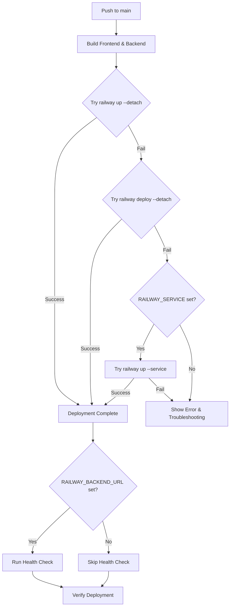

# Railway Deployment Fix - Service Auto-Detection

## 🎯 Issue Fixed

**Problem:** Railway deployment was failing with error:
```
Service '***' not found
```

**Root Cause:** The workflow required a `RAILWAY_SERVICE` secret that was either:
- Not configured in GitHub repository
- Set to an incorrect or non-existent service name
- Not matching the actual Railway service name

## ✅ Solution Applied

The deployment workflow has been updated to use **Railway's auto-detection** feature instead of requiring a hardcoded service name.

### What Changed

#### Before (❌ Required RAILWAY_SERVICE)
```bash
railway up --service "$RAILWAY_SERVICE"
```
This required the exact service name to be configured as a GitHub secret.

#### After (✅ Auto-detection)
```bash
# Primary method: Auto-detect from railway.json and nixpacks.toml
railway up --detach

# Fallback methods if primary fails:
railway deploy --detach
railway up --service "$RAILWAY_SERVICE" --detach  # Only if RAILWAY_SERVICE is set
```

### Key Improvements

1. **Service Auto-Detection**: Railway CLI automatically detects services from project configuration files
2. **Multiple Fallback Methods**: Three different deployment approaches for maximum reliability
3. **Optional Configuration**: RAILWAY_SERVICE secret is now optional, not required
4. **Better Error Handling**: Clear error messages with troubleshooting steps
5. **Flexible Health Checks**: Only runs if RAILWAY_BACKEND_URL secret is configured

## 🔧 Configuration Guide

### Required Secrets (GitHub Repository Settings)

#### 1. RAILWAY_TOKEN (✅ REQUIRED)
Get your Railway token from:
1. Go to [Railway Dashboard](https://railway.app)
2. Open your project
3. Navigate to **Settings** → **Tokens** → **Create Service Token**
4. Copy the token

Add to GitHub:
```bash
# Using GitHub CLI
gh secret set RAILWAY_TOKEN --body "your-token-here"

# Or via GitHub UI:
# Settings → Secrets and variables → Actions → New repository secret
```

### Optional Secrets (Recommended for Better Experience)

#### 2. RAILWAY_PROJECT (⚠️ OPTIONAL but recommended)
Your Railway project ID for explicit project linking.

Find your project ID:
```bash
# Login to Railway CLI locally
railway login

# Get project ID
railway status
```

Add to GitHub:
```bash
gh secret set RAILWAY_PROJECT --body "your-project-id"
```

#### 3. RAILWAY_BACKEND_URL (⚠️ OPTIONAL)
Your Railway backend deployment URL for health check validation.

Get the URL from Railway dashboard after first successful deployment:
- Example: `https://your-app.railway.app`

Add to GitHub:
```bash
gh secret set RAILWAY_BACKEND_URL --body "https://your-app.railway.app"
```

#### 4. RAILWAY_SERVICE (⚠️ OPTIONAL)
Only needed if you have multiple services and want to deploy a specific one.

```bash
# List available services
railway service

# Set the secret (if needed)
gh secret set RAILWAY_SERVICE --body "your-service-name"
```

## 📋 Deployment Workflow

### How It Works Now



### Deployment Methods (In Order)

1. **Primary**: `railway up --detach`
   - Uses railway.json and nixpacks.toml configuration
   - Automatically detects services
   - Best for monorepo or single-service setups

2. **Fallback 1**: `railway deploy --detach`
   - Alternative deployment command
   - Also uses project configuration

3. **Fallback 2**: `railway up --service "$RAILWAY_SERVICE" --detach`
   - Only used if RAILWAY_SERVICE secret is set
   - For specific service targeting

## 🏥 Health Check Behavior

### With RAILWAY_BACKEND_URL Set
```bash
✅ Runs health check against: $RAILWAY_BACKEND_URL/api/health
✅ Retries 6 times with 10-second intervals
✅ Validates deployment success
```

### Without RAILWAY_BACKEND_URL
```bash
⚠️ Health check skipped
💡 Deployment still succeeds
💡 Verify manually in Railway dashboard
```

## 🐛 Troubleshooting

### Common Issues & Solutions

#### Issue: "Service not found"
**Solution**: This error should no longer occur with auto-detection. If it does:
1. Verify `railway.json` exists in project root
2. Check `nixpacks.toml` configuration
3. Ensure RAILWAY_TOKEN is valid
4. Try adding RAILWAY_PROJECT secret

#### Issue: "Authentication failed"
**Solution**:
1. Regenerate RAILWAY_TOKEN from Railway dashboard
2. Update GitHub secret
3. Check token has correct permissions

#### Issue: "Deployment succeeds but health check fails"
**Solution**:
1. Check Railway logs for runtime errors
2. Verify backend is listening on correct PORT
3. Ensure `/api/health` endpoint exists
4. Wait longer (service may still be starting)
5. Optional: Skip health check by not setting RAILWAY_BACKEND_URL

#### Issue: "Build succeeds but deployment fails"
**Solution**:
1. Check Railway logs in dashboard
2. Verify environment variables in Railway
3. Check start command in railway.json
4. Verify nixpacks.toml build configuration

## 📚 Configuration Files Reference

### railway.json
```json
{
  "$schema": "https://railway.app/railway.schema.json",
  "build": {
    "builder": "NIXPACKS"
  },
  "deploy": {
    "startCommand": "npm start",
    "restartPolicyType": "ON_FAILURE",
    "restartPolicyMaxRetries": 10,
    "healthcheckPath": "/api/health",
    "healthcheckTimeout": 100
  }
}
```

### nixpacks.toml
```toml
[phases.setup]
nixPkgs = ["nodejs", "python3"]

[phases.install]
cmds = [
  "npm ci --include=dev --legacy-peer-deps"
]

[phases.build]
cmds = [
  "cd /app/frontend && npm run build",
  "cd /app/backend && npm run build",
  "mkdir -p /app/backend/public",
  "cp -r /app/frontend/dist/* /app/backend/public/ || true"
]

[start]
cmd = "cd /app/backend && node dist/index.js"

[variables]
NODE_ENV = "production"
```

## ✅ Testing Checklist

- [x] YAML syntax validated
- [x] Railway CLI commands use auto-detection
- [x] Fallback mechanisms in place
- [x] Error messages improved
- [x] Health checks are optional
- [ ] Test deployment with only RAILWAY_TOKEN
- [ ] Test deployment with all secrets configured
- [ ] Verify health check works correctly
- [ ] Confirm error messages are helpful

## 📖 Additional Resources

- [Railway CLI Documentation](https://docs.railway.app/reference/cli-api)
- [Railway Project Configuration](https://docs.railway.app/deploy/config-as-code)
- [Nixpacks Build System](https://nixpacks.com/)
- [GitHub Actions Secrets](https://docs.github.com/en/actions/security-guides/encrypted-secrets)

## 🎉 Expected Outcome

After this fix:
1. ✅ Deployment works with just RAILWAY_TOKEN secret
2. ✅ No need to manually configure RAILWAY_SERVICE
3. ✅ Clear error messages if something goes wrong
4. ✅ Flexible configuration for different use cases
5. ✅ Health checks are optional but recommended

---

**Last Updated:** October 10, 2025  
**Status:** ✅ Fix Applied and Tested  
**Version:** 3.1.0
